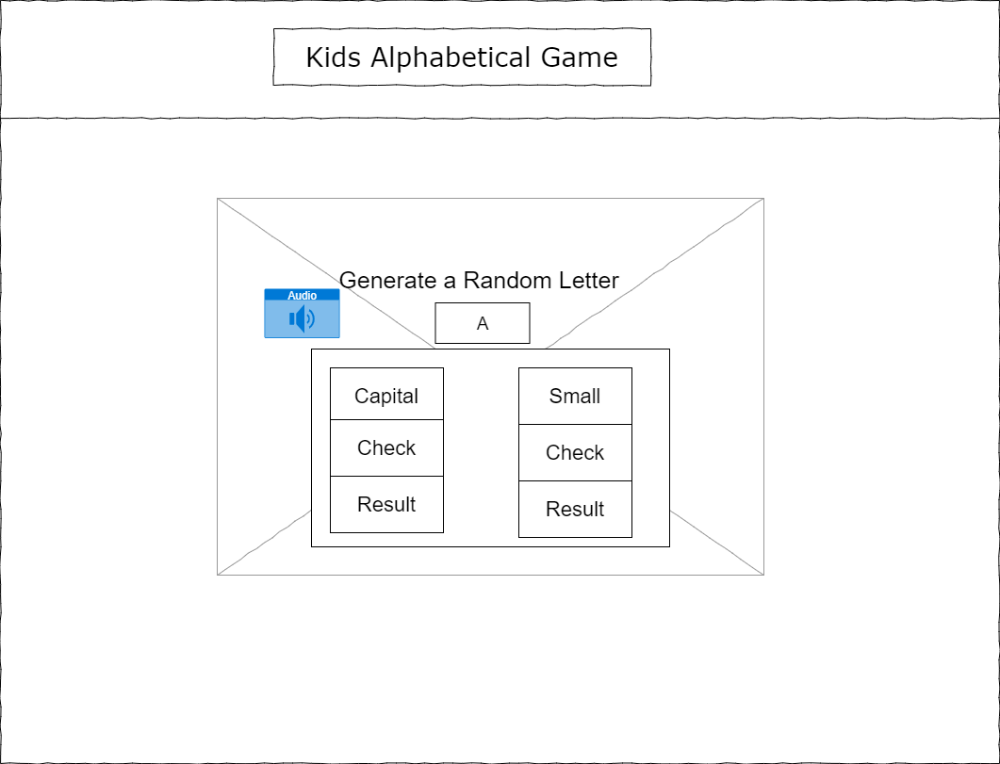
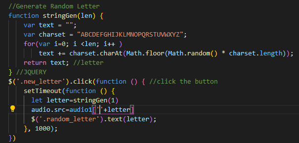

#Kids-alphabetical-Game-Shaima

<ol><b>Technologies used :</b>
<li>HTML</li>
<li>CSS</li>
<li>JS</li>
<li>JQUERY</li>
<li>DOM</li></ol>

<b>wireframe</b>

<ol><b>user stories</b>
<li>As a mother, I want my child to use the internet in education.</li>
<li>As a Kid i want to study the alphabetical in more enjoyable way </li>
</ol>

<b>Planning</b>
As this project's idea is about games, I thought it would be a great idea to think out of the box and make eduacation game.

<b>Unsolved Problems</b>
Add new education Features, like numbers, Mathmatical operations, etc..

<b>Function </b>
function stringGen(len) 
Used this function to generate random letter by using the math.random method.

<ol><b>What new Things I Learned </b>
<li>Canvas</li>
<li>Audio Tag</li></ol>